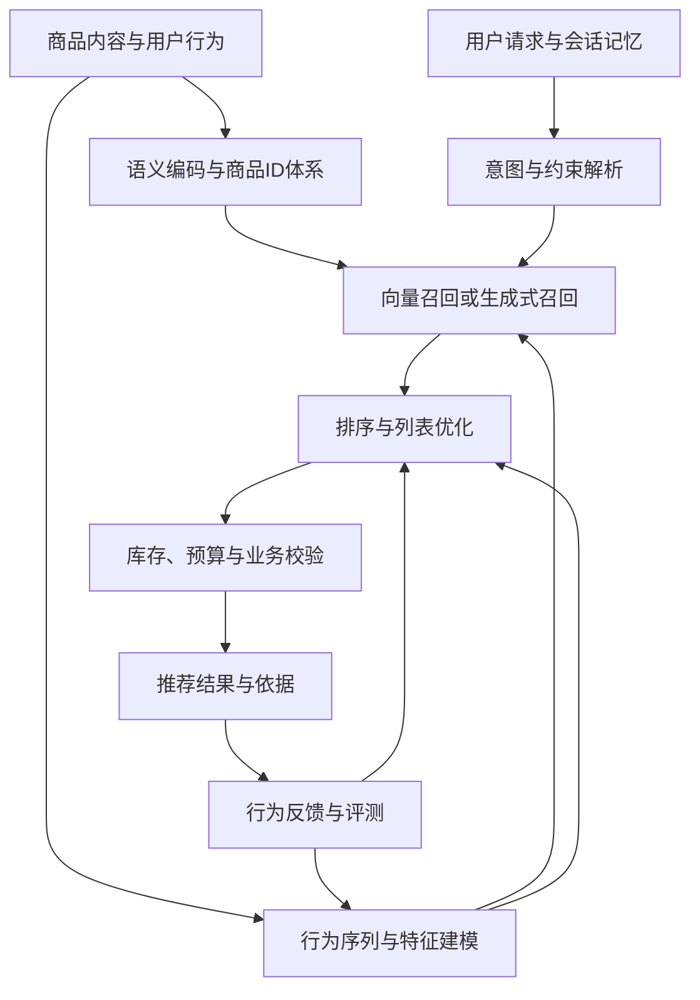

> **核心判断：** 推荐系统正在同时扩大语义知识、行为建模能力和可用计算预算。决定收益的变量包括数据质量、模型结构、训练目标、候选生成和服务成本；仅比较参数量，很容易得出错误结论。
{: .prompt-info }

**检索截止：2026 年 9 月 20 日。** 本文面向推荐算法与 LLM 工程实践，覆盖 2022—2026 年基础工作，重点追踪 2025—2026 年进展，并补查 2026 年 9 月的 arXiv 更新。技术事实以论文、作者仓库和团队官方文章为依据；最新预印本与工业自报结果均保留其证据边界。这是一份广泛检索后的精选技术综述，不宣称穷尽全部论文，也不把“最新”视为“最可靠”。

## 1. 先给结论：哪些方向已经有证据，哪些仍需验证

1. **大型推荐模型的扩展规律已经有工业证据，但具有架构和场景依赖。** HSTU、Wukong 及后续系统表明，更适合行为序列与特征交互的计算结构能改善扩展效率；早期 DLRM 的参数扩展饱和，也说明同一结论不能跨架构直接外推。[HSTU](https://arxiv.org/abs/2402.17152)、[Wukong](https://arxiv.org/abs/2403.02545)、[早期扩展研究](https://arxiv.org/abs/2208.08489)。
2. **语言预训练和行为预训练承担不同作用。** 前者提供商品内容、意图和常识表示，后者学习真实曝光、点击、购买和消费序列。二者可以结合，但采用 Transformer 的推荐模型未必使用语言预训练权重。[HLLM](https://arxiv.org/abs/2409.12740)、[HSTU](https://arxiv.org/abs/2402.17152)。
3. **生成式推荐已进入工业实践，统一程度仍有差异。** 生成商品 ID、生成候选集、生成整页列表和用生成式骨干做逐商品排序，是四种不同任务。2026 年的 TGR 同时包含这些路线，并明确保留多个模块。[TGR](https://arxiv.org/abs/2609.00986)。
4. **更长历史、更好的商品表示和更合理的计算分配，往往比单独扩大参数更值得先试。** 这是一项综合工程判断，依据包括 LLaTTE 的分阶段历史编码、WHALE 的结构与序列联合扩展，以及生产系统的缓存和动态路由设计。[LLaTTE](https://arxiv.org/abs/2601.20083)、[WHALE](https://arxiv.org/html/2607.17017v2)。
5. **推荐中的推理与 RL 有前景，评测目标必须贴近业务。** 候选排序指标、商品约束满足、列表效用和会话成功率，分别对应不同任务；更长的解释和更高的语言模型似然，均不能单独证明个性化质量提升。

**实践建议：** 对已有推荐链路，优先做语义表示增强、强行为基线与预算可控的重排；对生成式召回，先证明固定候选预算下的增益；对购物助手，先建立工具与约束评测。模型规模扩展应在这些基础上进行。

## 2. 技术地图：LLM、生成式推荐与大型推荐模型

### 2.1 三个经常混用的概念

| 概念 | 模型主要学习什么 | 常见输出 | 是否必须从通用 LLM 初始化 |
| --- | --- | --- | --- |
| LLM 增强推荐 | 文本、图像、意图、可解释偏好 | 向量、特征、分数、解释、工具调用 | 通常会利用语言或多模态预训练 |
| 生成式推荐 | 给定历史或意图，生成物品表示或列表 | 物品 ID、语义 ID、候选列表、整页 slate | 不必须 |
| 大型推荐模型（LRM） | 大规模行为与上下文中的交互规律 | CTR/CVR、多任务分数或下一物品 | 不必须 |

三者存在交集。例如，语言模型可以生成语义 ID，推荐 Transformer 也可以仅预测行为概率。论文标题中的 *generative*、*foundation model*、*trillion parameters*，都需要回到模型输入、初始化、训练目标和服务路径逐项核对。

### 2.2 一张图理解它们如何进入推荐链路

下图是本文的工程归纳，表达可组合的模块关系，不对应某篇论文的完整实现。

**特别注意：** 商品内部 ID 是工具和模型使用的标识；用户表达中的数字应优先按型号、价格、容量、尺寸等语义解释。语义 ID 也必须通过确定的商品目录映射回实际物品，不能靠自然语言输出自行证明商品存在。

## 3. 推荐系统的 Scaling Law 到底应该怎么读

### 3.1 经验曲线、资源分配与业务收益是三个问题

常见的经验拟合形式可以写为：

$$
L(N,D)\approx L_{\infty}+aN^{-\alpha}+bD^{-\beta}.
$$

这里的 $L$ 是指定评测分布上的损失，$N$ 是明确口径的模型容量，$D$ 是明确口径的数据规模。它是待数据验证的模型假设，不是推荐系统通用定理。$L_{\infty}$、指数及系数可能随架构、样本选择、标签定义和时间窗口改变。

语言模型研究中的 Chinchilla 强调固定训练计算预算下模型规模与数据量的共同选择。它提供了实验方法上的启发，具体比例不能直接移植到稀疏推荐系统。[Training Compute-Optimal Large Language Models](https://arxiv.org/abs/2203.15556)。

推荐任务还必须明确以下口径：

| 变量 | 必须披露的口径 | 容易造成的误读 |
| --- | --- | --- |
| 参数 $N$ | 稠密骨干、稀疏 embedding、激活参数分别多少 | 把巨大的 ID 表等同于同规模稠密 LLM |
| 数据 $D$ | 独立事件、用户、物品、文本 token、曝光负例、去重方式 | 重复训练同一批日志也被当成新增信息 |
| 历史长度 $S$ | 事件数还是文本 token 数；取样和压缩方法 | 序列更长就一定包含更多有效偏好 |
| 训练计算 $C$ | 实际 FLOPs、训练时长、硬件与 MFU | 同 FLOPs 被误当成同训练成本 |
| 推理预算 $B$ | 候选数、beam、思考长度、重排轮数 | 增大搜索空间后仍声称“同成本更好” |
| 指标 | LogLoss/NE、AUC、Recall、NDCG、转化、收入 | 混淆损失下降、离线排名改善与线上收益 |

早期 [Understanding Scaling Laws for Recommendation Models](https://arxiv.org/abs/2208.08489) 在研究的 DLRM 架构中观察到参数扩展趋于饱和，数据扩展更有希望。后续新架构的改进与这一结果可以并存：**扩展规律描述的是给定系统，而非所有推荐任务的共同曲线。**

### 3.2 为什么推荐数据的“更多”尤其复杂

推荐日志由已有曝光策略产生，未点击商品并不自动代表用户不喜欢；消费偏好、库存和价格还会随时间变化。因此，扩展历史天数可能同时增加信息、旧偏好和策略偏差。扩大 ID 表也可能主要增加长尾存储容量，其每步计算量与稠密网络不同。

本文建议把工程决策写成多约束问题：

$$
\max_{\theta,S,B}\;\mathbb{E}[U(\pi_{\theta,S,B})]
\quad\text{s.t.}\quad
C_{\mathrm{train}}\le C_0,\;
\mathrm{P99}_{\mathrm{serve}}\le\tau,\;
M\le M_0.
$$

$U$ 是预先定义的效用，$M$ 是服务内存，$\tau$ 是尾延迟上限。这是本文提出的实验组织方式，不是从某篇论文迁移来的已验证定律。实际系统还应增加库存、曝光多样性和约束违反率等条件。

### 3.3 怎样判断论文真的支持了 Scaling Law

至少核对五项：有多个规模点而非两个模型；存在计算预算对齐或明确的资源差异；报告拟合区间与残差；在更大规模或后续时间段上检验预测；说明曲线究竟对应训练损失、离线质量还是线上指标。

对于小规模复现，建议报告“在本数据和预算范围内观察到的扩展趋势”。三四个规模点的平滑曲线，不足以支持跨数据、跨架构、跨数量级的外推。

## 4. 主线一：让推荐模型本身具备更好的扩展能力

### 4.1 HSTU 与 Wukong：两类不同的计算结构

**HSTU** 将用户行为建模为序列转导，使用门控、点式注意力及适配变长序列的实现；其排序形式仍可预测候选商品的动作分布。M-FALCON 通过复用历史计算服务多个候选。论文报告了跨三个数量级训练计算的扩展趋势，但 1.5T 参数包含 embedding，私有业务收益也不能用公开数据完整复现。[论文全文](https://arxiv.org/html/2402.17152v3)、[官方实现](https://github.com/meta-recsys/generative-recommenders)。

**Wukong** 重点扩展非序列特征交互：堆叠 Factorization Machine Block 与 Linear Compression Block，让高阶交互随着深度与宽度增长。它提供公开与大规模内部数据的离线证据。HSTU 和 Wukong 分别强调历史与特征交互，二者的组合也成为后续研究方向。[论文全文](https://arxiv.org/html/2403.02545v4)。

### 4.2 从单模块扩展到结构、序列与系统联合设计

表中时间采用首次公开年份或月份；后续版本另行注明。**“有线上实验”表示作者披露了实验，不表示本文完成了独立复现。**

| 工作 | 时间 | 主要改变 | 证据与边界 |
| --- | --- | --- | --- |
| [Scaling Law of Large Sequential Recommendation Models](https://arxiv.org/abs/2311.11351) | 2023；RecSys 2024 | 纯 item-ID 序列模型扩展到 0.8B，以较小模型预测大模型损失 | 支持协同序列模型自身的扩展；不依赖语言预训练 |
| [Scaling Laws and Approximate Entropy](https://arxiv.org/html/2412.00430v6) | 2024；2025 更新 | 将 HR/NDCG、序列规律性与容量联系起来 | 近似熵是研究线索；不应当成通用数据质量标准 |
| [FuXi-alpha](https://arxiv.org/html/2502.03036v1) | 2025-02 | 分开建模时间、位置、语义，并加强隐式交互 | 华为音乐 7 天、30% 流量实验，作者报告平均听歌时长 +5.10% |
| [MTGR](https://arxiv.org/html/2505.18654v4) | 2025-05 | HSTU 与现有交叉特征、用户级压缩及动态 mask 结合 | 删除原有交叉特征的损失，在该场景不能简单靠扩容补回 |
| [ARGUS](https://arxiv.org/html/2507.15994v2) | 2025-07；2026 更新 | 同时学习下一物品与反馈，研究到 1B | 线上实验使用 126M encoder；1B 线上实验未开展 |
| [Jagged Context Parallelism](https://arxiv.org/html/2508.04711v2) | 2025 | 为 HSTU 的变长历史做上下文并行 | 主要解决显存与长度限制；通信成本会抵消部分收益 |
| [PerSRec](https://arxiv.org/html/2601.03479v1) | 2026 预印本；作者标注 ICDM 2025 | 用个性化 token 压缩较旧历史，保留近期事件 | 数据筛选包含高活跃用户条件，不能直接推广到全人群 |
| [Kunlun](https://arxiv.org/html/2602.10016v3) | 2026-02；06 更新 | 注意力、分层池化、滑窗、计算跳过与事件个性化协同 | B200 MFU 17%→37%；scaling efficiency 与吞吐是不同指标 |
| [ULTRA-HSTU](https://arxiv.org/html/2602.16986v2) | 2026-02 | 合并事件表示、半局部注意力、深度拓扑和混合精度 | 论文的 5.3×/21.4×是训练/推理扩展效率口径，不能当成绝对速度 |
| [SSR](https://arxiv.org/html/2604.08011v4) | 2026-04 | 多视图稀疏过滤后再密集融合 | AliExpress 两周实验：相对同参数 RankMixer，GMV +3.5%，时延 25→26ms |
| [UniFormer](https://arxiv.org/html/2606.27058v1) | 2026-06 | 联合特征与任务空间扩展，拆分可复用计算 | 快手双产品线上实验；请求复用加速有指定对照，不能跨系统套用 |
| [WHALE](https://arxiv.org/html/2607.17017v2) | 2026-07；08 更新 | 逐层融合 Wukong 与 HSTU，以特征交互分支查询历史 | 80B 训练样本；线上匿名主指标 +0.113%，推理 QPS 同时下降 5% |

这些结果更适合支持一个**有条件的判断**：架构优化能让更多计算被用于有效交互与历史建模，进而改善扩展曲线。它们无法证明“所有业务都应该换成同一个最大模型”。

两个反例值得保留。MTGR 的线上 PV_CTR 增益，medium 为 +2.29%，large 为 +1.90%，规模与各个业务指标并非严格单调。FuXi-alpha 的消融则提示，增加训练负样本可能比增加层数更有效。扩展实验应同时检查训练目标和采样策略。[MTGR 线上表](https://arxiv.org/html/2505.18654v4)、[FuXi-alpha 消融](https://arxiv.org/html/2502.03036v1)。

### 4.3 数据扩展：合成数据已经证明了什么

[Principled Synthetic Data Enables the First Scaling Laws for LLMs in Recommendation](https://arxiv.org/html/2602.07298v3) 将商品文本、协同关系与图游走历史组织为持续预训练课程，在 Qwen3 0.6B—8B 上研究损失扩展。其“First”需要按作者限定的 LLM 持续预训练范围理解，推荐模型扩展研究早已存在。

这篇论文常被引用的 **Recall@100 +130% 来自 SASRec 的合成训练、真实测试实验，并做了共有物品词表过滤**；它不等于 CPT LLM 的线上提升。文中说明 LLM 端到端线上验证仍在进行。由此可以合理推断，结构化数据设计值得实验；尚不能推断合成数据普遍优于真实行为，或已经消除了曝光与流行度偏差。

## 5. 主线二：把 LLM 的语义与推理能力接入推荐

### 5.1 从文本特征到行为—语言对齐

直接用通用文本 embedding 计算相似度，容易忽略“共同被什么用户消费”这一协同信息。相似商品可能互为替代，也可能满足完全不同的预算和场景；描述相近同样不意味着用户会连续购买。因此，语义与行为信号的对齐是比“把商品描述喂给 LLM”更核心的问题。

| 工作 | 时间 | 接入方式 | 应如何理解结果 |
| --- | --- | --- | --- |
| [RLMRec](https://arxiv.org/abs/2310.15950) | 2023；WWW 2024 | 将语义画像与协同表示对齐 | 可增强原推荐器；画像构造必须避免测试交互泄漏 |
| [LLaRA](https://arxiv.org/abs/2312.02445) | 2023；SIGIR 2024 | 将 ID embedding 投影到 LLM 空间，与文本混合 | 其有限候选选择协议应单列，不能混入全量召回成绩 |
| [A-LLMRec](https://arxiv.org/abs/2404.11343) | 2024；KDD 2024 | 将预训练协同过滤知识接入 LLM | 关注 warm/cold 差异；语义优势不能保证所有 warm 场景获胜 |
| [HLLM](https://arxiv.org/abs/2409.12740) | 2024-09 | Item LLM 编码商品内容，User LLM 建模交互序列 | 明确研究语言预训练与推荐微调的价值；是两层建模方案 |
| [UniRec](https://arxiv.org/html/2601.19423v3) | 2026-01；04 更新 | 属性名—类型—值建模，分层 Q-Former 聚合属性、商品和历史 | 将图文、类别、数值统一；强调结构化字段的语义，而非全部文本化 |
| [Token Factory](https://arxiv.org/abs/2606.19635) | 2026-06 | 将异构推荐信号转换为 LRM 可消费的 soft tokens | 本轮核验到原始摘要；不引用未充分核验的线上数字 |

**工程推断：** 高 QPS 推荐通常可以先离线生成商品表示、理由和画像，在线使用缓存表示与较小模型；低 QPS、高决策价值的请求再分配更多 LLM 计算。这个选择需要以更新频率、冷启动占比和语义特征带来的增量验证。

### 5.2 2026 年 9 月的新证据：SARA 把“为什么喜欢”变成排序信号

[SARA](https://arxiv.org/html/2609.17639v1) 于 **2026-09-15** 首次提交 arXiv，收集用户喜欢与不喜欢内容的自然语言理由，再用 SFT 与 Quality-Refining DPO 训练多模态模型，将理由扩展到更大作者集合，接入现有多任务排序和负反馈记忆分支。

它提供了有价值的工业自报证据：1% 流量的独立实验中，正向分支 Watch Time 相对 +0.986%，负向分支 Hate 相对 −8.164%。二者是不同实验路径，不能相加。这里的 scaling 主要体现理由信号覆盖扩大，不能仅凭标题认定已建立普适幂律；私有数据、长期迁移效果和独立复现仍是限制。

### 5.3 语义理解、协同预测与约束执行应分别评估

假设用户希望购买“通勤用、轻便、预算 800 元以内的耳机”。系统至少需要完成三个不同任务：从文本理解通勤与轻便的含义；用行为信号估计用户对降噪、品牌和形态的偏好；查询实时价格并验证预算。前两项可以由模型学习，第三项应由商品数据和确定性规则核实。

实践中可同时建立三个测试集：语义检索集、个性化排序集、硬约束任务集。这样才能定位增益来自哪一层，也能识别“回答更流畅、实际商品更不合适”的回归。

## 6. 主线三：从语义 ID 到生成式召回与列表生成

### 6.1 为什么要把物品编码成短 token 序列

以 [TIGER](https://arxiv.org/abs/2305.05065) 为代表，先从物品内容得到向量，再用残差量化产生语义 ID（SID），由序列模型预测目标物品的短码序列。其条件概率可写为：

$$
p_{\theta}(\mathrm{SID}(i)\mid h)=\prod_{k=1}^{m}p_{\theta}(c_k\mid h,c_{<k}),\qquad
\mathrm{SID}(i)=(c_1,\ldots,c_m).
$$

这是 SID 序列的概率；将其用于商品打分，还需要合法目录约束、碰撞消解和 SID—物品映射，不能直接当成已在商品全集上归一化的概率。**短码降低了生成空间的组织难度，也把物品表示质量变成新的瓶颈。** 早期 token 选错会限制后续分支；内容量化也可能丢掉协同信号。因此，tokenizer、训练目标和解码过程都需要联合考虑。

### 6.2 技术脉络与代表工作

| 工作 | 时间 | 核心进展 | 证据边界 |
| --- | --- | --- | --- |
| [TIGER](https://arxiv.org/abs/2305.05065) | 2023-05 | RQ-VAE 语义量化与自回归检索 | 基础学术范式；不需要通用语言预训练 |
| [LC-Rec](https://arxiv.org/abs/2311.09049) | 2023-11 | 通过多任务对齐把协同语义接入 LLM | 需要分辨语义相近与协同偏好相近 |
| [LETTER](https://arxiv.org/abs/2405.07314) | 2024-05 | 在 tokenizer 中加入协同对齐与码分配多样性 | 说明 SID 应服务推荐目标，不能只优化内容重构 |
| [LIGER](https://arxiv.org/html/2411.18814v2) | 2024-11 | 结合生成候选与 dense retrieval 的评分能力 | 控制输入后，部分 dense 基线强于 TIGER；仅小规模公开基准 |
| [OneRec](https://arxiv.org/abs/2502.18965) | 2025-02 | session-wise 生成、稀疏 MoE、偏好对齐 | 工业生成推荐；不能直接认定为通用 LLM 微调 |
| [OneRec-V2](https://arxiv.org/html/2508.20900v4) | 2025-08；10 更新 | Lazy Decoder 与共享上下文，结合真实反馈后训练 | 扩展实验到 8B；论文线上配置为 1B，两者不可混写 |
| [OneRec-Think](https://arxiv.org/html/2510.11639v1) | 2025-10 | 语言预训练、推荐对齐、推理与 RL，离线 Think-Ahead | 在线读取推理生成的前缀，不是每个请求都实时长 CoT |
| [MACRec](https://arxiv.org/abs/2511.15122) | 2025-11 | 多方面跨模态量化与对齐 | 公开数据离线证据；图文融合仍需验证协同价值 |
| [OpenOneRec](https://arxiv.org/abs/2512.24762) | 2025-12；2026-02 更新 | 语言与推荐训练链，1.7B/8B 权重及 RecIF-Bench | 公开研究起点；并不等于工业 OneRec 全栈的原样开源 |
| [UniGRec](https://arxiv.org/abs/2601.17438) / [DIGER](https://arxiv.org/abs/2601.19711) | 2026-01 | soft/differentiable SID，让推荐梯度影响物品编码 | 需检查码本坍缩、硬化过程和目录更新成本 |
| [GEMs](https://arxiv.org/abs/2602.13631) | 2026-02 | 近期、中期、生命周期三路历史处理 | 覆盖十万级历史依赖分流与压缩，不能理解为直接密集注意力 |
| [GR4AD](https://arxiv.org/abs/2602.22732) | 2026-02；04 更新 | 广告 SID、价值感知训练、列表优化、动态 beam | 收益来自模型与服务组合；广告价值目标与普通商品命中不同 |
| [Multi-Decoder OneRec](https://arxiv.org/abs/2607.26500) | 2026-07 | 共享用户编码、目标独立适配、显式配额与去重 | 固定 512 候选预算；后续排序和重排保持一致 |
| [TGR](https://arxiv.org/html/2609.00986v1) | 2026-09 | 生成式骨干排序、SID 召回、整列表与离线理由注入 | 多模型组合栈；各模块的线上结果应分别解释 |

### 6.3 2026 年的重点：可控性、联合训练和迁移方式

**多目标控制。** Multi-Decoder OneRec 为不同目标分配可控的候选配额，并处理跨解码器重复。这解决的是“给定候选预算如何平衡目标”，比单纯增大 beam 更接近生产约束。其数据管线 [Kwai26](https://github.com/liuzhao09/Kwai26-Data-Pipeline) 提供研究入口。

**统一程度。** TGR 的 CCFormer 保留逐物品多任务输出，BARGE 作为生成式召回通道，HiGR 面向 slate generation，Reason 则引入离线产生的 SID 理由 token。它说明工业升级可以逐段进行；“端到端”必须注明统一了哪些模块。[TGR 技术报告](https://arxiv.org/html/2609.00986v1)。

**兼容已有系统。** 2026-09-16 的 [LIGE-GR](https://arxiv.org/html/2609.18148v1) 将已有 itemwise 排序系统扩展为 listwise 生成与评价，保留现有模型、价值函数和服务设施；它在请求已有候选集内组织列表，区别于全库 SID 召回。作者报告了 Instagram Reels 与 Facebook Video 的部署收益；本文核验了摘要与候选集定义，未独立复现其工业结果。

**泛化不能只看平均分。** [How Well Does Generative Recommendation Generalize?](https://arxiv.org/abs/2603.19809) 将记忆主导与组合泛化样本分开，观察到 GR 和 item-ID 模型各有所长。结合 LIGER 的对照，当前证据更支持分场景比较和混合方案，无法支持“生成式模型全面替代传统推荐”的结论。

## 7. 工业系统告诉我们：计算复用和知识共享同样重要

### 7.1 Meta：召回、基础模型、排序与训练基础设施分工

| 系统 / 官方来源 | 公开时间 | 核心机制 | 需要保留的限制 |
| --- | --- | --- | --- |
| [Andromeda](https://engineering.fb.com/2024/12/02/production-engineering/meta-andromeda-advantage-automation-next-gen-personalized-ads-retrieval-engine/) | 2024-12-02 | 层次索引与召回模型联合训练，GPU 与索引遍历协同 | 当时文章将自回归目标列为后续方向，不能改写为已部署 SID 自回归系统 |
| [GEM](https://engineering.fb.com/2025/11/10/ml-applications/metas-generative-ads-model-gem-the-central-brain-accelerating-ads-recommendation-ai-innovation/) | 2025-11-10 | 跨场景行为与内容训练；通过蒸馏、表示及参数共享赋能下游模型 | 属于推荐基础模型；文章中的后训练不自动意味着 GRPO 或 RLHF |
| [Lattice](https://arxiv.org/html/2512.09200v1) | 2025-12-09 | 跨域、多目标、数据和模型整合，异步知识迁移 | “revenue-driving top-line metrics”不能改写为公司收入同比增幅 |
| [Adaptive Ranking Model](https://engineering.fb.com/2026/03/31/ml-applications/meta-adaptive-ranking-model-bending-the-inference-scaling-curve-to-serve-llm-scale-models-for-ads/) | 2026-03-31 | 请求级计算复用、动态路由、选择性 FP8 和多卡服务 | 万亿量级参数包含大量稀疏表；收益限定于文章描述的人群和场景 |
| [Hierarchical Interest Representation](https://engineering.fb.com/2026/07/15/ai-research/exploring-hierarchical-interest-representation-for-meta-ads-deep-funnel-optimization/) | 2026-07-15 | 图关系与 LLM/VLM 语义结合，层次兴趣表示和跨视图蒸馏 | 官方研究方向；本轮未核验到可单独归因的线上增益 |
| [GEM Training](https://engineering.fb.com/2026/08/03/ml-applications/training-gem-at-llm-scale-meta-ads-recommendation-foundation-model/) | 2026-08-03 | 变长注意力、嵌入通信、低精度与多维并行联合优化 | E2E MFU 翻倍至 20%—25%；训练 FLOPs 扩大不等于质量同比例提升 |
| [LLaTTE 工程解读](https://engineering.fb.com/2026/08/05/ml-applications/from-user-sequences-to-scaling-laws-a-multi-stage-architecture-for-metas-ads-ranking/) | 2026-08-05；论文首发 01-27 | 大型异步用户历史编码，加在线轻量目标感知排序 | 博文部分转化收益与其他模型创新合计，不能全部归因 LLaTTE |

[LLaTTE](https://arxiv.org/abs/2601.20083) 特别值得精读：把与候选无关的历史计算提前完成并缓存，在线处理新行为与候选相关交互。它同时扩展深度、宽度、历史长度和语义信息密度，并研究上游增益如何传递到下游。

由这些系统可以推导出一条实用路线：先识别哪些计算能按商品、用户、请求或时间窗口复用，再决定哪些计算必须逐候选执行。更大模型的可部署性往往取决于这个分解。

### 7.2 Netflix：扩展曲线还受任务上限与缓存时效影响

[Towards Generalizable and Efficient Large-Scale Generative Recommenders](https://arxiv.org/html/2605.23312v2) 的 **2026-08-06 版本**研究从 2M 到 1B 的骨干参数扩展，参数口径排除 embedding 与 decoding layers；同时考虑任务相关的曲线上限、sampled softmax、投影解码头和冷启动语义塔。

它用多未来物品监督匹配表示缓存的刷新延迟；这里的 MTP 应按该任务定义理解，不能直接等同于语言模型投机解码。论文披露的百万用户、一周 **production-shadow MRR** 评估不会改变用户看到的推荐，属于真实流量上的影子评测。它与随机线上 A/B 的因果业务收益有明确区别，且系统同时改了多个组件。

### 7.3 Pinterest：覆盖万级历史不等于全部进入 Transformer

[TransAct V2](https://arxiv.org/html/2506.02267v1) 先从长历史中做候选相关近邻筛选，再结合最近实时行为；生产配置进入 Transformer 的序列长度为 192。相对原版 TransAct、每组覆盖 1.5% Homefeed 访客的实验中，论文自报 repin volume +6.35%、hide volume −12.80%。

其启发在于，**历史覆盖长度、最终注意力长度和在线计算量可以解耦**。对成本有限的团队，应把历史检索与压缩作为长序列基线，随后再验证直接加长注意力是否有额外价值。

### 7.4 系统基准也在变化

[MLCommons DLRMv3（2026-02-10）](https://mlcommons.org/2026/02/dlrmv3-inference-meta/) 使用 HSTU 风格排序、约 1TB embedding 配置与合成流式数据，服务场景要求 P99 延迟满足 80ms 阈值。它体现了长历史、稀疏表、数据搬运和缓存对系统评估的重要性。

这是硬件与推理系统基准，不能把它的合成数据准确率当成真实消费者满意度，也不能把大 embedding 内存直接换算成同规模稠密语言模型的能力。

## 8. 推理、RL 与 Test-Time Scaling：如何让额外计算产生价值

### 8.1 三种“推理时扩展”需要分开

| 方式 | 增加了什么计算 | 希望改善什么 | 必须测量什么 |
| --- | --- | --- | --- |
| 解码搜索 | beam 宽度、分支校验、候选数 | 生成召回覆盖和合法路径选择 | 相同候选预算的 Recall、去重率、解码时延 |
| 语义推理 | 理由 token、多轮反思、工具调用 | 复杂意图、偏好与约束理解 | 任务成功、约束违反、实际排序变化、总 token |
| 自适应服务 | 更强模型、更多候选交互、选择性路由 | 将计算分配给更有价值或更困难请求 | 分人群增益、P99、成本、路由退化 |

长 CoT、宽 beam 和请求级计算复用是不同技术。把它们统一标成“推理更久”会掩盖真实成本与收益机制。

### 8.2 代表性方法

| 工作 | 时间 | 训练或推理机制 | 当前证据支持的范围 |
| --- | --- | --- | --- |
| [Rec-R1](https://arxiv.org/html/2503.24289v4) | 2025-03；2026-01 更新 | 固定检索/推荐器，用下游表现奖励 LLM 生成策略 | 适合查询改写与生成—检索闭环；公开离线证据 |
| [R²ec](https://arxiv.org/abs/2505.16994) | 2025-05 | 推理生成头与物品预测头结合，RecPO 联合优化 | 避免全靠商品文本生成；不等于已验证工业 SLA |
| [RecZero / RecOne](https://arxiv.org/abs/2510.23077) | 2025-10 | 结构化推理、规则奖励、GRPO，可加冷启动 SFT | 核心任务是 rating prediction，不能外推全量召回 |
| [PROMISE](https://arxiv.org/abs/2601.04674) | 2026-01 | 轻量 PRM 给 SID 中间步骤评分，指导 beam 剪枝 | 缓解早期语义漂移；本轮主要核验原始摘要，不重述未核验数值 |
| [R2Rank](https://arxiv.org/html/2602.12530v1) | 2026-02 | 逐物品理由与评分头，通过列表效用更新 | 每例 20 候选的重排实验，不能作为百万商品直接排序证明 |
| [ILRec](https://arxiv.org/abs/2602.17410) | 2026-02 | 从中间层获取困难负例，进行偏好优化与蒸馏 | 后训练收益也取决于负样本和信用分配质量 |
| [HCGRec / Learning from Unreachable Rewards](https://arxiv.org/html/2608.11980v2) | 2026-08 | 训练时给最短目标前缀，监督前缀、GRPO 优化后缀 | 处理难样本全零奖励；推理不应获得目标提示 |
| [OneLA](https://arxiv.org/html/2609.12399v1) | 2026-09-11 | 共享线性注意力前缀状态，紧凑记录 beam 分叉与祖先 | 1.54—2.46×是整个模型 decode-forward 加速，非完整推荐请求加速 |

### 8.3 奖励设计决定了模型在优化什么

在推荐环境中，“正确答案”经常不唯一。隐式日志的下一次点击，只是特定曝光策略下的一次观察。以命中单个物品为唯一奖励，可能鼓励热门物品、牺牲多样性，并让大量 rollout 得到同样的零分。

本文建议按任务设置奖励，而不是先选 GRPO 再寻找能用的标签：检索关注相关性与召回；重排关注列表效用；购物任务以可执行约束与环境校验为基础；长期推荐再通过线上实验验证留存和负反馈。业务价值、推理长度和工具成本可以作为单独维度报告，避免一个总分掩盖失败原因。

**实验上必须对齐预算。** 如果一个方法生成八条推理轨迹再选最好结果，对照也应获得相近 token、候选数或延迟预算。还应单独比较无推理、短推理、离线推理特征与实时推理，判断收益来自哪里。

## 9. Agent 推荐：多轮购物和自动化研发是两类应用

### 9.1 面向用户：意图、记忆、工具和结果校验

[MR.Rec（2025-10）](https://arxiv.org/abs/2510.14629) 探索外部记忆检索、推理与 RL 的结合；[REGEN / LUMEN（2025-03）](https://arxiv.org/abs/2503.11924) 则加入用户自然语言批评与引导，研究用户说“太贵”“换个风格”后如何调整推荐。后者基于真实评论，但包含合成的叙述和引导，不能视作完整真实用户对话日志。

[ShoppingBench](https://arxiv.org/html/2508.04266v4) 提供包含 250 万以上真实商品的交互沙箱与 3,310 条购物指令，覆盖预算、优惠和多商品组合条件。其价值在于把 Agent 的成败落到可以检查的任务结果上。商品数据来自真实世界，环境仍是沙箱，指令包含模拟生成；成功率不能当作真实支付转化率。[官方代码](https://github.com/yjwjy/ShoppingBench)。

对购物助手，本文建议维护两层状态：**当前任务的明确约束**，以及**附来源、时间和置信度的长期偏好**。用户本次“送给别人”的需求不应直接覆盖其长期口味；商品价格、库存和优惠必须由工具返回；完成候选选择后再执行约束校验。此处是工程方案，不是对某个开源框架能力的宣称。

### 9.2 面向研发：让 Agent 管理昂贵的推荐实验

[Auto-RecSys（2026-09-10）](https://arxiv.org/html/2609.10922v1) 针对一次训练持续多日的工业推荐实验，设计分布式异步执行、跨服务器持久记忆，以及自然语言规划与确定性执行分离的机制。实验执行经验和研究结论分别进入两个迭代回路。

这类工作扩展的是**实验吞吐与执行可靠性**，不直接证明某一推荐模型的预测 scaling law。可以借鉴其状态机、失败恢复和实验记录；模型增益仍应由冻结的评测协议检验，避免 Agent 持续适配测试集。自动提出更多想法，也需要记录失败实验和总计算成本。

## 10. 证据审计：哪些“提升”不能直接相信

### 10.1 四种证据互相补充，不能合并成一个排行榜

| 证据类型 | 可以说明什么 | 不能据此声称什么 |
| --- | --- | --- |
| 公开离线数据 + 实现 | 方法可检查，有复现起点 | 已适用于私有业务，或本文已经成功复现 |
| 独立复现 | 特定结论在额外实现与设置下是否成立 | 一次失败推翻全部同类路线 |
| 私有工业 A/B 自报 | 指定平台、时期、流量和基线下有真实部署证据 | 同样 uplift 可迁移、跨论文可加总、所有组件独立有效 |
| 生产影子评测 / 摘要级结果 | 真实分布的离线质量线索或待追踪方向 | 已产生用户体验、交易、收入的因果改善 |

本文的数字全部保留原任务口径；没有对不同平台的百分比做高低排名。未检索到代码，也只表示本轮未确认，不能推断作者从未或永不开放实现。

### 10.2 三类直接影响 LLM 推荐结论的研究

**位置偏差。** [RISE（2025-08）](https://arxiv.org/html/2508.02020v1) 研究候选顺序对 LLM 推荐结果的影响。评测至少应随机置换和反转候选；若正例总出现在固定位置，漂亮的结果可能来自提示结构捷径。

**预训练污染。** [Benchmark Leakage Trap（2026-02；05 更新）](https://arxiv.org/html/2602.13626v3) 通过受控持续预训练模拟污染，研究同域与跨域交互泄漏的影响。它支持“污染会改变结论”的机制，不能据此断言某个未公开训练集的模型确实记住了测试集。[BiasRecBench（2026-03）](https://arxiv.org/abs/2603.17417) 则控制候选质量差异并注入无关语境，检查推荐是否被偏差影响；合成校准场景与实际用户行为仍有差别。

**画像可编辑不等于排序可控。** 2026-09-17 的独立复现 [Reproducing Transparent and Scrutable Recommendations](https://arxiv.org/abs/2609.19831) 发现，在所测评分回归方案中，编辑画像可能使评分整体平移，却没有检测到预期的类别选择性变化，排序也可能不变。这个负结果针对具体模型和目标；它提醒我们必须用干预实验验证“用户能控制推荐”的产品承诺。

### 10.3 发布结果前的最小核查表

| 核查项 | 建议做法 |
| --- | --- |
| 时间泄漏 | 用全局时间切分，商品元数据、画像、图和 tokenizer 仅访问允许时间的信息 |
| 候选协议 | 明确全库检索、采样候选还是上游真实召回候选；保留同一候选集对照 |
| 冷启动定义 | 分开报告新用户、新商品、新交互组合、跨域零样本 |
| 预算公平 | 同时报告训练 FLOPs/GPU 小时、推理 token/beam、候选数、P50/P99、显存 |
| 稳定性 | 多个随机种子，按用户或合适实验单元计算区间；报告分人群与长尾 |
| 真实偏好 | 区分明确不喜欢、曝光未点击与从未曝光；说明负采样方式 |
| 可控性 | 改预算、品牌排除、偏好方向后，检查结果是否按预期改变 |
| 解释可信度 | 商品事实可追溯到检索结果；单独评估解释与实际打分的一致性 |
| 长期价值 | 在适用业务中追踪负反馈、退货、留存、多样性；不只看点击 |

## 11. 实践路线：根据问题选技术，再做扩展实验

以下是基于前述证据的**技术建议**，不包含已经运行的实验结果，也不承诺特定硬件上的吞吐或提升。

### 11.1 方向选择表

| 当前瓶颈 | 优先验证 | 对照与成功条件 |
| --- | --- | --- |
| 商品冷启动、描述复杂 | 内容 embedding、HLLM 式分层表示、UniRec 式字段编码 | 相同用户模型下比较 ID、语义、融合；看新商品和长尾增益 |
| warm 用户协同信号不足 | 强序列基线、HSTU、合理负采样 | 固定数据和调参预算，验证全库排序与校准 |
| 历史太长、在线时延高 | 历史检索、压缩、候选无关缓存 | 与全量历史比较信息损失、刷新滞后和 P99 |
| 召回目标彼此冲突 | 多目标生成式召回、配额、去重 | 固定总候选预算；观察各目标与曝光多样性 |
| 用户意图与约束复杂 | LLM 查询改写、工具调用、小候选重排 | 任务成功与确定性约束检查，记录每步失败类型 |
| 解释好看但推荐不变 | 排序目标训练、画像干预测试 | 修改画像后应有方向正确、可复现的排序变化 |
| 模型扩容无收益 | 数据质量、任务目标、特征/历史结构与系统剖析 | 先定位饱和环节，再追加参数和计算 |

### 11.2 四阶段可复现实验

**阶段 A：统一数据与基线。** 固定一套带时间戳的交互数据和商品元数据，建立 popularity、协同过滤/双塔、SASRec 或相应强基线。明确全库与候选重排两套协议，冻结训练、验证、测试边界及候选生成规则。输出应包含数据卡、切分脚本和可重复的基线表。

**阶段 B：验证语义与行为的增量。** 比较 ID-only、content-only、融合表示、LLM 离线特征四组；分别统计 warm/cold、热门/长尾、短/长历史。加入参数规模相近的非语言预训练对照，避免把所有提升归给世界知识。

**阶段 C：生成式方案与局部扩展曲线。** 选 LETTER/DIGER/UniGRec 中一个可检查实现，与 dense retrieval 比较；固定候选数、数据和调参预算。先试三个模型规模与三个历史长度，并记录负样本、beam 和 GPU 时间。随后用额外规模点检验拟合外推，而不是仅画穿过训练点的曲线。

**阶段 D：引入推理或 Agent。** 给同一召回器增加查询改写、少量候选的 LLM 重排或 ShoppingBench 工具策略。比较无推理、短推理、离线理由和实时多步推理；在相近总成本下，只有任务成功与约束满足持续改善，才进入 SFT/RL 或更大推理预算实验。

若只有单张 16—24GB 显卡，优先做小型序列模型、离线 embedding、量化小模型推理及受控小规模适配；训练能否装下取决于历史长度、batch、优化器和表示缓存。多卡资源应优先用于公平的重复实验和规模网格，随后再考虑大模型全量训练。工业稀疏表与多日私有日志的结论，不能在小数据集上原样重现。

### 11.3 建议保存的实验记录

每次实验至少记录：数据快照与时间范围、代码 commit、模型与 tokenizer、稠密/稀疏参数、历史长度、负采样、训练预算、候选来源、解码设置、缓存策略、随机种子，以及质量—成本指标。失败实验也应保存。

判断下一笔计算预算投在哪里，可以用一个简单原则：**选择在当前瓶颈上带来最大可验证增量的变量。** 如果候选召回遗漏了目标，增加重排推理无济于事；如果价格信息过时，扩大模型也无法修复事实；如果用户兴趣已压缩丢失，优先修复历史表示。

## 12. 优先阅读与可实践资源

### 12.1 按学习目标安排阅读

| 学习目标 | 建议顺序 |
| --- | --- |
| 理解推荐 scaling | 早期 DLRM scaling → HSTU/Wukong → Kunlun/WHALE → LLaTTE/Netflix |
| 理解语言与协同结合 | RLMRec/A-LLMRec → HLLM → UniRec → SARA |
| 理解生成式推荐 | TIGER → LETTER/LC-Rec → LIGER → OneRec-V2 → Multi-Decoder/TGR |
| 理解后训练与推理预算 | Rec-R1 → R²ec → PROMISE → HCGRec → OneLA |
| 做可靠实验 | 位置偏差 → 数据污染 → 自然语言画像复现 → 自己的干预与成本对照 |

### 12.2 已核实的作者实现入口

下表表示本轮已查到作者项目入口，**不表示已安装、跑通或独立复现**。使用前还需核对数据许可、模型许可、硬件要求与当前版本。

| 资源 | 最适合做什么 |
| --- | --- |
| [Meta Generative Recommenders](https://github.com/meta-recsys/generative-recommenders) | 阅读 HSTU 与推荐序列计算实现 |
| [HLLM](https://github.com/bytedance/HLLM) | 实验商品内容与用户行为的分层建模；仓库于 2026-08-28 归档 |
| [RLMRec](https://github.com/HKUDS/RLMRec) / [A-LLMRec](https://github.com/ghdtjr/A-LLMRec) | 语义与协同信号对齐 |
| [LC-Rec](https://github.com/RUCAIBox/LC-Rec) / [LETTER](https://github.com/HonghuiBao2000/LETTER) | SID 与协同语义基础实验 |
| [DIGER](https://github.com/junchen-fu/DIGER) / [UniGRec](https://github.com/Jialei-03/UniGRec) | tokenizer 与推荐目标联合优化 |
| [OpenOneRec](https://github.com/Kuaishou-OneRec/OpenOneRec) | 推荐基础模型、公开权重与训练评测链 |
| [UniRec](https://github.com/ulab-uiuc/UniRec) | 多模态、类别、数值等结构化信号融合 |
| [Rec-R1](https://github.com/linjc16/Rec-R1) / [R²ec](https://github.com/YRYangang/RRec) | 下游反馈驱动的生成或推理优化 |
| [Kwai26](https://github.com/liuzhao09/Kwai26-Data-Pipeline) | 多目标生成式召回的数据处理 |
| [ShoppingBench](https://github.com/yjwjy/ShoppingBench) | 购物 Agent 的工具、约束与任务成功评测 |
| [LLMRec Data Leakage](https://github.com/yusba1/LLMRec-Data-Leakage) | 构建污染与泄漏对照实验 |
| [MLPerf DLRMv3](https://github.com/mlcommons/inference/tree/master/recommendation/dlrm_v3) | 推理系统、流式负载与延迟测试设计 |

继续拓展时，可用 [多模态 LLM 推荐综述](https://arxiv.org/abs/2505.09777) 导航术语，性能结论仍回到原始论文。更多系统方向包括 [OneRec-V2 量化推理](https://arxiv.org/abs/2603.11486)、[UniMixer](https://arxiv.org/html/2604.00590v2) 和 [VaLiDRec](https://arxiv.org/abs/2607.25209)；它们分别关注服务成本、特征混合与物品标识设计，不宜被合并为同一种 scaling 改进。

## 13. 仍然开放的问题

1. **可外推的扩展规律。** 当前曲线能否预测新的平台、时间段、物品库或更大模型？任务相关上限和数据质量应如何进入拟合？
2. **目录持续变化。** 生成式 SID 如何支持新商品、下架、库存变更、码本重训和历史兼容，同时维持可用率与冷启动质量？
3. **推荐推理的必要性。** 哪些请求值得实时推理，哪些可离线计算？推理理由是否具有稳定的决策贡献？
4. **奖励与长期偏好。** 短期点击优化如何避免损伤用户满意、探索和多样性？模拟用户与真实反馈之间的差距多大？
5. **可比较的开放基准。** 是否有同时覆盖真实长历史、完整候选空间、内容、曝光、明确负反馈和严格时间切分的数据？

这些问题对应下一轮研究价值，也决定了“模型做大”能否转化为实际系统收益。一个值得投入的项目，应同时给出效果提升、预算代价、失效场景和复现入口。

---

**来源与核验说明：** 原始来源已随每个论断或表格条目提供，链接中的 arXiv 版本号标识本轮使用的版本。检索结合广域关键词、代表工作引文追踪、作者仓库、工业团队文章，并补查 [arXiv cs.IR 最新列表](https://arxiv.org/list/cs.IR/recent)。论文首次提交、修订、会议接收与博客发布日期分别处理；未核对正式会刊的条目，不仅凭标题推定发表级别。重点数量与实验条件通过原文核对；Token Factory、PROMISE 主要采用原始摘要，LIGE-GR 额外核对了候选集定义。本文未运行模型实验，工业结果均为作者自报，建议与研究者综合判断已明确区分。
